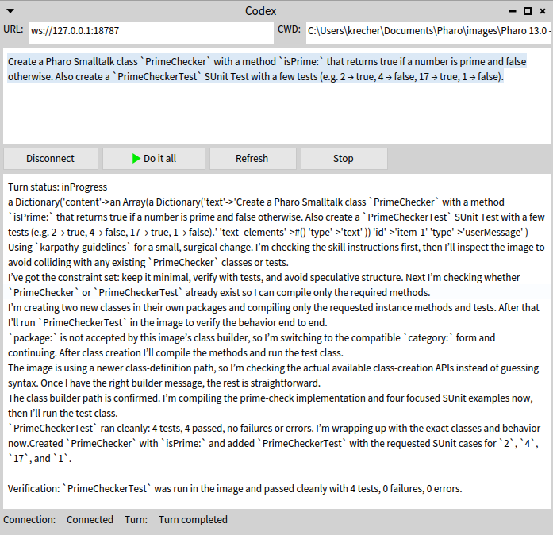

# OpenAI-Codex

`PharoCodex` is a Pharo client for OpenAI Codex. The GitHub project is named `PharoCodex`; the Pharo package is named `OpenAI-Codex`.

Codex is OpenAI's software engineering agent for writing code, running tasks, and working with tools. See <https://openai.com/codex/>.

This project includes a simple Spec2 application (`OpenAICodexSpec2Application`) that can connect to a running `codex app-server`, send prompts, and display results inside Pharo.

## Scope

This repository contains:

- `OpenAI-Codex`: the core protocol, session, announcement, and transport abstractions
- `OpenAI-Codex-Tests`: SUnit coverage for serialization, session flow, approvals, and transport wiring
- `BaselineOfOpenAICodex`: Metacello baseline

## Current transport options

- `OpenAICodexWebSocketTransport` for `ws://` connections to an externally started `codex app-server`
- `OpenAICodexStdioTransport` for line-oriented `stdio` integration when you provide your own subprocess adapter

For Windows/Pharo, the recommended setup is WebSocket transport with the app-server started separately from the command line.

## Loading

```smalltalk
Metacello new
	repository: 'github://StefanKrecher/PharoCodex';
	baseline: 'OpenAICodex';
	load.
```

## Pharo MCP server

`OpenAI-Codex` is intended to be used together with a Pharo MCP server so Codex can inspect and control a running Pharo image. One option is `PharoMCPServer`:

- GitHub: <https://github.com/StefanKrecher/PharoMCPServer>

You can load it with Metacello:

```smalltalk
Metacello new
	repository: 'github://StefanKrecher/PharoMCPServer';
	baseline: 'PharoMCPServer';
	load.
```

## First use

```smalltalk
transport := OpenAICodexWebSocketTransport toUrl: 'ws://127.0.0.1:8787'.
session := OpenAICodexSession onTransport: transport.
session start.
session
	initializeClientNamed: 'pharo_codex'
	title: 'Pharo Codex'
	version: '0.1.0'.
```

## Recommended Windows setup

Start the app-server outside of Pharo:

```powershell
codex app-server --listen ws://127.0.0.1:8787
```

Then connect from Pharo:

```smalltalk
transport := OpenAICodexWebSocketTransport toUrl: 'ws://127.0.0.1:8787'.
session := OpenAICodexSession onTransport: transport.
session start.
session
	initializeClientNamed: 'pharo_codex'
	title: 'Pharo Codex'
	version: '0.1.0'.
```

## Spec2 demo application

Open the simple Spec2 client:

```smalltalk
OpenAICodexSpec2Application open
```



The presenter lets you:

- connect to a running `codex app-server`
- create or reuse a session thread
- submit a prompt
- display streamed output plus visible MCP tool call results
